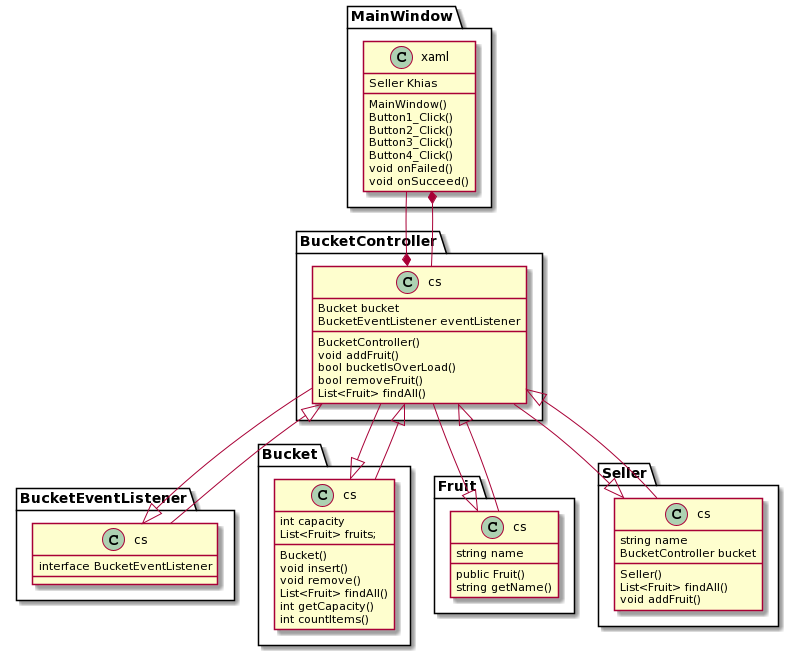

# Fresh Fruit

Aplikasi ini digunakan untuk memfasilitasi pengguna untuk membeli buah-buahan dengan memasukkannya pada keranjang virtual.

## Scope & Functionalities
* User dapat memilih tombol ADD untuk memilih buah-buahan yang ingin dibeli seperti anggur, apel, pisang dan/atau jeruk.
* User dapat melihat buah apa saja yang telah masuk keranjang untuk dibeli.
* User mendapat info "Maaf keranjang penuh" jika keranjang yang tersedia telah penuh.

## How does it works?
1. Fungsi `BucketEventListener.cs` adalah sebagai class interface untuk fungsi **void onFailed()** dan **void onSucceed()** untuk mempermudah pewarisan fungsi-fungsi tertentu.
Interface juga berfungsi untuk menyembunyikan detail fungsi dari class yang terkandung dalam interface tersebut, sehingga class-class yang mengakses interface dapat memiliki detail fungsinya masing-masing.
2. Class diagram dari projek ini
* 
3. Pembahasan alur atau logika pemrogramannya:
* Fungsi dari **public void addFruit** dipanggil ketika button add ditekan.
* Dilakukan pengecekan apakah **public Bucket(int capacity)** yaitu fungsi penampungan dari model class `Bucket.cs` penuh atau tidak. 
* Fungsi untuk pengecekan keranjang terdapat pada controller class `BucketController.cs`.
* Jika keranjang penuh, maka fungsi **bucketIsOverLoad** dipanggil dan akan menampilkan pesan "Oops, keranjang penuh.".
* Jika keranjang belum penuh, maka fungsi dari **this.bucket.insert(fruit)** dipanggil dan akan menampilkan pesan "Yeay, item berhasil ditambahkan".